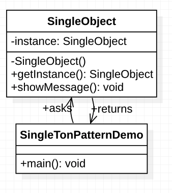

# 单例模式

这种模式涉及到一个单一的类。

**注意：**

- 1、单例类只能有一个实例。
- 2、单例类必须自己创建自己的唯一实例。
- 3、单例类必须给所有其他对象提供这一实例。

# 意图

保证一个类仅有一个实例，并提供一个可以访问他的全局访问点。

# 主要解决

一个全局使用的类频繁的创建与销毁。

# 何时使用

想要控制实例类的数目，节省系统资源的时候。

# 如何解决

判断是否有这个单例有则返回，无则创建。

# 关键代码

构造函数是私有的。

# 应用实例：

- 1、一个班级只有一个班主任。
- 2、Windows 是多进程多线程的，在操作一个文件的时候，就不可避免地出现多个进程或线程同时操作一个文件的现象，所以所有文件的处理必须通过唯一的实例来进行。
- 3、一些设备管理器常常设计为单例模式，比如一个电脑有两台打印机，在输出的时候就要处理不能两台打印机打印同一个文件。

# 优点

- 1、在内存里只有一个实例，减少了内存的开销，尤其是频繁的创建和销毁实例（比如管理学院首页页面缓存）。
- 2、避免对资源的多重占用（比如写文件操作）。

# **缺点**

没有接口，不能继承，与单一职责原则冲突，一个类应该只关心内部逻辑，而不关心外面怎么样来实例化。

# **使用场景**

- 1、要求生产唯一序列号。
- 2、WEB 中的计数器，不用每次刷新都在数据库里加一次，用单例先缓存起来。
- 3、创建的一个对象需要消耗的资源过多，比如 I/O 与数据库的连接等。

# 实现

