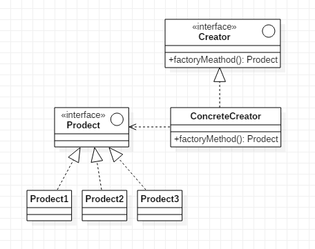

# 创建型设计模式

创建型设计模式包含：

`Factory`，`AbstractFactory`,`Builder`,`Prototype`,`SingleTon` 五种。

# Factory Pattern

**何时使用**
我们明确地计划不同条件下创建不同实例时。  

**目的**
定义一个创建对象的接口，让其子类自己决定实例化哪一个工厂类，工厂模式使其创建过程延迟到子类进行。

**优点** 

1. 一个调用者想创建一个对象，只要知道其名称就可以了。   
2. 扩展性高，如果想增加一个产品，只要扩展一个工厂类就可以。   
3. 屏蔽产品的具体实现，调用者只关心产品的接口。  

**缺点**

 每次增加一个产品时，都需要增加一个具体类和对象实现工厂，使得系统中类的个数成倍增加，在一定程度上增加了系统的复杂度，同时也增加了系统具体类的依赖。这并不是什么好事。   
 ps：可以通过反射来解决工厂对象的增加或修改的问题。

UML 类图：

# Abstract Factory Pattern
**何时使用**
系统的产品有多于一个的产品族，而系统只消费其中某一类产品族。

**目的**
提供一个创建一系列 相关或相互依赖对象 的接口，而无需指定他们的具体类。

**优点** 

当一个产品族的多个对象被设计成一起工作时，可以保证只使用一个产品族的对象。  

**缺点**

产品族的扩展需要修改抽象工厂接口。

PS：这一问题可以通过反射解决。

UML 类图：

